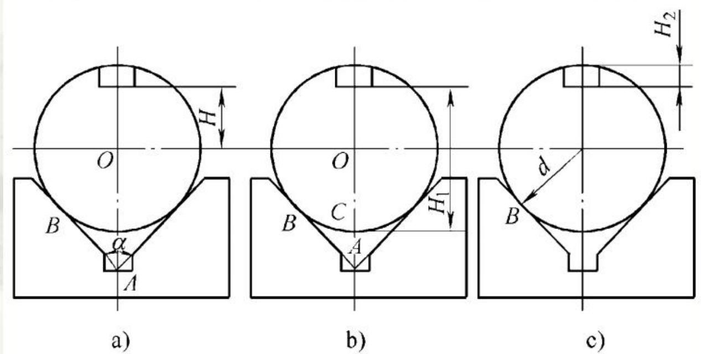

# 5.3.3定位误差的分析与计算

# 3、定位误差的计算事例（V形块定位）

定位基准为外圆的中心，工序基准分别为外圆中心、下母线、上母线。

<table><tr><td>工序基准</td><td>定位基准</td><td>△D</td></tr><tr><td>H尺寸：O</td><td>圆心</td><td>△B=0,△w≠0</td></tr><tr><td>H尺寸：下母线</td><td>圆心</td><td>△B≠0,△w≠0</td></tr><tr><td>H2尺寸：上母线</td><td>圆心</td><td>△B≠0,△w≠0</td></tr></table>

第五章 机床夹具设计

$$
\Delta _ { \mathrm { { w } } } ~ = ~ { \frac { T _ { D } } { 2 \sin { \frac { \alpha } { 2 } } } }
$$

随着α角度增大，△w减小，但当α过大，引起工件水平方向上定位不稳定。一般取 $\tt a = 9 0 ^ { \circ }$

定位误差的大小与标注方法有关

$$
\Delta _ { p _ { i } } = \Delta _ { { \bf r } _ { 1 } } = \frac { T _ { p } } { 2 s \sin \frac { \alpha } { 2 } } { \Delta _ { p _ { 2 } } } = \Delta _ { { \bf r } _ { 2 } } - \Delta _ { p _ { 2 } } = \frac { T _ { p } } { 2 } \left( \frac { 1 } { \sin \frac { \alpha } { 2 } } - 1 \right) \Delta _ { p _ { 3 } } = \Delta _ { { \bf r } _ { 3 } } + \Delta _ { { \cal B } _ { 3 } } = \frac { T _ { p } } { 2 } \left( \frac { 1 } { \sin \frac { \alpha } { 2 } } + 1 \right)
$$