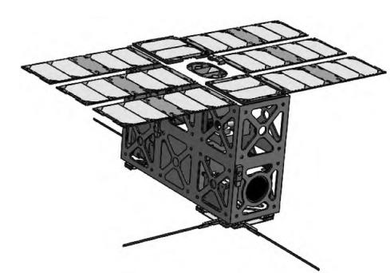
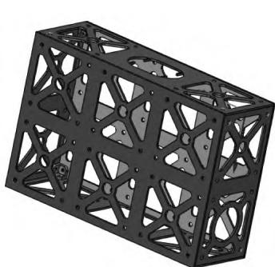
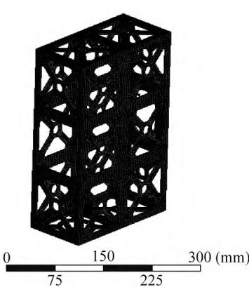
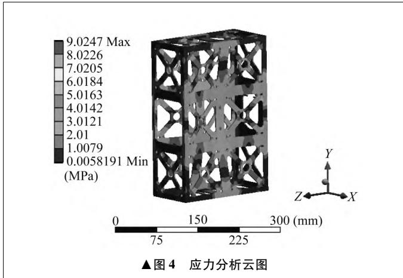
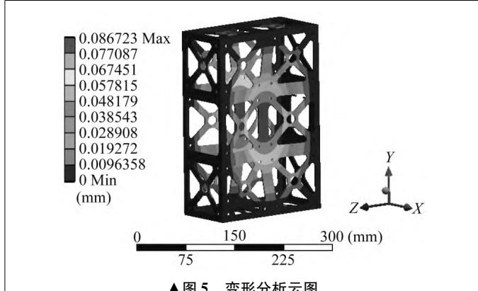
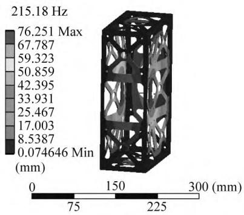
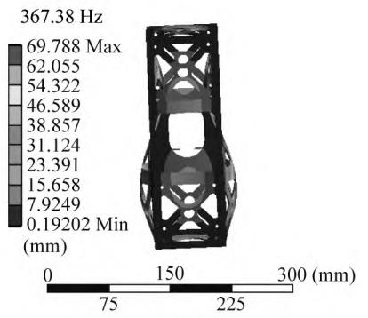
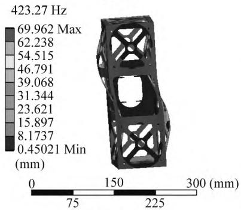
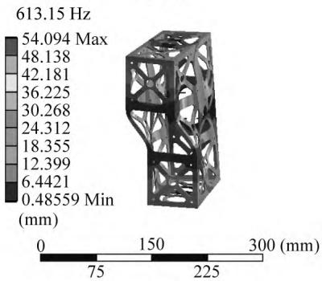
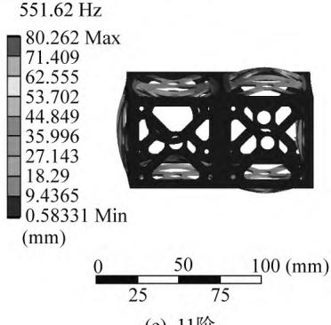

# 微小卫星主承力结构设计与力学特性分析

□ 吴 彬 □ 黄晓萍 □ 胡诗悦南京机电职业技术学院 机械工程系 南京 211300

摘 要:微小卫星主承力结构主要采用由蜂窝铝板组成的箱板式结构，加工复杂，周期长。 对此，设计了框架式微小卫星主承力结构。 对所设计的主承力结构进行静力学分析，最大应力为9．025 MPa，小于材料的最大屈服应力，最大变形为0．087 mm，小于设计要求的沿坐标轴方向最大变形，满足强度和刚度要求。 同时进行1 阶至12 阶模态分析，8 阶模态前后两面向 X 轴正方向凹陷，出现最大位移83．293mm，12 阶模态整体沿 Y 轴方向扭转，出现最大振动频率613．15 Hz。 力学特性分析结果为微小卫星主承力结构的振动与噪声研究提供了理论依据。

关键词: 卫星 承力 结构 设计 力学 分析中图分类号: V423． 4 + 2 文献标志码: A 文章编号: 1000 － 4998( 2024) 11 － 0056 － 04

Abstract: Main load － bearing structure of microsatellite mainly adopts the box － type structure composed of honeycomb aluminum plate，which is complicated for processing and has a long cycle． Therefore，the frame main load － bearing structure of microsatellite was designed． The static analysis of the designed main load － bearing structure shows that the maximum stress is 9． 025 MPa，which is less than the maximum yield stress of the material，and the maximum deformation is 0． 087 mm，which is less than the maximum deformation in the direction of the coordinate axis required by the design，and meets the requirements of strength and stiffness． In the meanwhile，the mode analysis of order 1 to order 12 shows that the mode of order 8 is the front and back faces depressing in the positive direction of X axis，and the maximum displacement is 83． 293 mm． The mode of order 12 is torsional in the direction of Y axis，and the maximum vibration frequency is 613． 15 Hz． The analysis result of mechanical characteristic provides a theoretical basis for the study of vibration and noise of the main load － bearing structure of microsatellite．

Keywords: Satellite Bearing Structure Design Mechanical Analysis

# 1 研究背景

随着卫星发射技术的突破和低轨大规模星群的提出，微小卫星得到快速发展，在对地观测、生态保护、科学探索等领域应用广泛［1］。 微小卫星的主承力结构起承载、传力的作用，为星载单机提供安装空间，是保证卫星强度和刚度等的重要结构部件。 目前，微小卫星主承力结构主要采用由蜂窝铝板组成的箱板式结构，设计和加工复杂，研制周期长［2］。 框架式结构由梁构件和支撑面板通过螺栓连接或焊接等方式装配完成，具有易加工、便于拆装、研制周期短、成本低、适合大批量快速生产等优点。 但另一方面，框架式结构具有抗扭转性能较差、连接处应力集中等缺点［3］。 文献［4］提出一种基于计算机辅助设计三维模型几何特征简化的卫星桁架结构快速建模仿真方法，并给出分别采用梁单元和壳单元建模的路径及软件界面。 文献［5］设计一种适合成组成批部署的双隔板四点连接式小卫星构型与结构，采用标准主承力结构，构型截面可变，结构主承力接头 X 轴方向间距可调，并且开展结构分析及优化设计。

研究框架式卫星承力结构，可以有效降低微小卫星研制成本，相较其它结构易加工和拆装。 对微小卫星框架式结构进行复杂环境下的静力学和模态分析，保证结构的材料强度和刚度满足设计要求，对微小卫星的研制具有重要意义。

# 2 微小卫星主承力结构设计

从立方星轻量化和连接处应力集中两个角度出发进行设计，满足质心变形要求，质心位于水平方向上的几何位置与 X、Y、Z 三个坐标轴方向的误差不大于 1mm。 运用 SolidWorks 软件进行微小卫星总体设计，结构主要包括光伏储能系统、展开机构、姿态控制系统、通信系统、遥感相机系统、自由载荷平台、主承力框架等 微小卫星三维模型如图1 所示

  
▲图1 微小卫星三维模型

主承力框架依据各分系统的功能要求、结构特点，设计为 300 mm × 100 mm × 200 mm 长方体孔板结构，孔板尺寸根据结构轻量化和提高强度的设计思想，在每 100 mm × 100 mm 的面上设计四个圆角过渡三角形。 所设计的微小卫星主承力框架结构如图2 所示。

  
▲图2 主承力框架结构

# 3 力学特性分析

# 3 ． 1 原理

微小卫星的过载环境分析属于线性弹性系统的应力分析，线性结构静态分析的等效方程为:

$$
\stackrel { N } { \Sigma } ~ [ { \cal K } _ { \mathrm { e } } ] \{ { \bf \Psi } u \} ~ = \{ { \bf \Psi } { \cal F } ^ { \alpha } \} ~ + \{ { \bf \Psi } { \cal F } ^ { \gamma } \}
$$

式中: N 为结构单元数; $[ \pmb { K } _ { e }$ ］为结构刚度矩阵; { u} 为结构各节点位移矢量; { ${ \pmb F } ^ { \propto } \}$ 为外载荷总矢量; { Fγ } 为支反载荷矢量。

根据位移插值函数和弹性力学各参量关系，可以得到结构各单元节点的应力和应变表达式［6］，为:

$$
\begin{array} { l } { \{ \pmb { \varepsilon } ^ { \mathrm { e l } } \} ~ = ~ [ \pmb { B } ] \{ \pmb { u } \} ~ - \{ \pmb { \varepsilon } ^ { \mathrm { t h } } \} } \\ { \{ \pmb { \sigma } \} ~ = ~ [ \pmb { D } ] \{ \pmb { \varepsilon } ^ { \mathrm { e l } } \} } \end{array}
$$

总第 723 期式中: { εel} 为结构应力引起的应变矢量; ［B］为结构各节点的应变位移矩阵; $\{ \pmb { \varepsilon } ^ { \mathrm { t h } } \}$ 为结构各节点的热应变矢量; { σ} 为结构各节点的应力矢量; ［D］为弹性矢量矩阵 。

通过求解微小卫星各节点对应的应变和应力，得到结构的静态特性［7］

# 3． 2 材料参数

在 Workbench 软件中定义材料参数［8 － 9］ 。 铝合金材料屈服强度为 200 MPa，密度为 2 800 kg /m3 ，弹性模量为 75 GPa，泊松比为 0． 33 。

# 3． 3 有限元模型

建立微小卫星有限元模型，进行网格划分，并施加载荷与约束。 在力学分析界面的网格控制项中，添加网格划分的尺寸控制。 网格相关度为 100，共生成网格数为 32 527，节点数为 35 674。 根据各分系统的实际载荷和结构特点，在各个分系统与框架连接处施加载荷和约束［10］。 微小卫星主承力框架有限元网格模型如图3 所示。

  
▲图3 主承力框架有限元网格模型

# 3． 4 静力学分析

在力学分析界面中，对微小卫星主承力框架模型进行应力求解，得到微小卫星主承力框架的应力分析云图，如图4 所示。

由图 4 可知，最大应力出现在 300 mm × 200 mm的面上，最大应力为 9． 025 MPa。 模型所用材料为铝合金，最大屈服应力为180 MPa，可见承受的最大应力小于最大屈服应力，满足强度要求。

在力学分析界面中，对微小卫星主承力框架模型进行弹性变形求解，得到微小卫星主承力结构的变形分析云图，如图5 所示

由图 5 可知，最大变形出现在 300 mm × 200 mm的面上，最大变形为0． 087 mm，满足设计要求。

# 3． 5 模态分析

对微小卫星主承力框架进行自由模态求解，求解前12 阶模态。 微小卫星主承力框架最大位移及固有频率见表1，7 ～ 12 阶模态振型如图6 所示。

  
表1 前12 阶最大位移及固有频率

<table><tr><td>阶次</td><td>最大位移/mm</td><td>频率/Hz</td></tr><tr><td>1</td><td>70.031</td><td>0</td></tr><tr><td>2</td><td>59.226</td><td>0</td></tr><tr><td>3</td><td>55.889</td><td>0</td></tr><tr><td>4</td><td>35.555</td><td>2.690 3 ×10 -4</td></tr><tr><td>5</td><td>43.184</td><td>5.102 4×10 -4</td></tr><tr><td>6</td><td>68.999</td><td>7.606 7 ×10 -4</td></tr><tr><td>7</td><td>76.251</td><td>215.18</td></tr><tr><td>8</td><td>83.293</td><td>302.79</td></tr><tr><td>9</td><td>69.788</td><td>367.38</td></tr><tr><td>10</td><td>69.962</td><td>423.27</td></tr><tr><td>11</td><td>80.262</td><td>551.62</td></tr><tr><td>12</td><td>54.094</td><td>613.15</td></tr></table>

  
（b）8阶

  
（c）9阶

  
（a）7阶  
（d）10阶

  
（f）12阶

  
（e）11阶  
▲图6 7 ～12 阶模态振型

由表 1 可知，微小卫星主承力框架前 6 阶振型固有频率基本为 0，这是由于在自由模态下前 6 阶模态属于刚体位移模态。 由模态振型可知，微小卫星主承力框架7 阶模态两面向内凹陷，8 阶模态前后两面向 X轴正方向凹陷，此时出现最大位移 83． 293 mm，9 阶、

10 阶、11 阶模态 300 mm × 200 mm 两侧面呈 S 形弯曲，12 阶模态整体沿 Y 轴方向扭转，此时出现最大频率613． 15 Hz。 微小卫星主承力框架自由模态下，从 1阶至12 阶振型经过刚性振型阶段、整体弹性振动阶段、局部弹性振动阶段。

总第 723 期

# 4 结束语

笔者设计了框架式微小卫星主承力结构，并且利用 ANSYS Workbench 有限元分析软件对微小卫星主承力框架进行力学特性分析，包括有限元静力学分析和模态分析。 静力学分析结果表明，微小卫星主承力框架最大应力为9．025 MPa，小于材料最大屈服应力，最大变形产生于 X 轴方向，为 0． 087 mm，小于设计要求的沿坐标轴两方向最大变形1 mm，满足材料强度和刚度设计要求，验证微小卫星主承力结构的设计可靠性。 模态分析结果表明，8 阶模态前后两面向 X 正方向凹陷，此时出现最大位移 83． 293 mm，9 阶 、10 阶 、11阶模态 300 mm × 200 mm 两侧面呈 S 形弯曲，12 阶模态整体沿 Y 轴方向扭转，此时出现最大频率 613． 15Hz。 模态分析结果为微小卫星主承力结构振动及噪声的研究提供理论依据。

# 参考文献

［1］ 赵研博． “M”微小卫星结构设计与力学特性分析［D］． 北京: 北京交通大学，2021．  
［2］ 林来兴． 微小卫星技术发展和应用前景［J］．国际太空，2019( 6) : 46 － 48．  
［3］ 张贺，王建楹，尹恩华． 外加载荷条件下框架结构的有限

( 上接第 100 页)

# 5 结束语

设计一种煤矿井下可视化智能监控系统，对系统架构、工作原理、井下应用情况进行了分析。

煤矿井下可视化智能监控系统网络传输架构使用5G 数据传输模块，数据传输速度快，信号稳定性高，能够满足视频监控可靠性需求

煤矿井下可视化智能监控系统的信号衰减在 － 85db 以内，最大通信延迟在17 ms 以内，对井下异常的识别准确率达到98%以上，满足设计要求。

# 参考文献

［1］ 孙继平，靳春海，曹玉超． 基于视频图像的矿井水灾识别及趋势预测方法研究［J］． 工矿自动化，2019，45( 7) :1 －4，16．  
［2］ 王国法，赵国瑞，任怀伟． 智慧煤矿与智能化开采关键核  
( 上接第 106 页)  
［16］ 张增辉，马文伟． 基于随机森林回归算法的回采工作面瓦斯涌出量预测［J］． 工矿自动化，2023，49( 12) : 33 － 39．  
［17］ 谢勇，项薇，季孟忠，等． 基于 Xgboost 和 LightGBM 算法预测住房月租金的应用分析［J］． 计算机应用与软件，2019，36( 9) : 151 － 155，191． ■元分析［J］． 机械工程自动化，2024( 1) : 92 － 94．  
［4］ 姚骏，张红英，程尧，等． 基于 CAD 三维模型几何特征简化的卫星桁架结构快速建模仿真与试验验证［J］． 航天器环境工程，2022，39( 5) : 515 － 521．  
［5］ 刘江，田宗军，徐欣，等． 一种适合组批部署的小卫星构型与结构设计［J］． 航天器工程，2023，32( 5) : 63 － 68．  
［6］ 华逢志，王东方，缪小冬． 基于 ANSYS Workbench 软件的汽车盘式制动器轻量化研究［J］． 机械制造，2020，58( 9) :40 － 44．  
［7］ 王源麟．微小卫星结构优化设计及其力学特性研究［D］．南京: 南京理工大学，2021．  
［8］ 杜佐飞，汤天宝，余春祥，等． 基于有限元法的 NW 型行星架结构优化［J］． 机械制造，2023，61( 11) : 13 － 18．  
［9］ 韩美燕，许宁，杨斌元，等． 批量化卫星储运一体化包装箱的设计［J］． 机械制造，2022，60( 10) : 42 － 45，51．  
［10］ 杨自鹏，彭慧莲，刘敏，等． 空间特性模拟的微小飞行器结构设计与动特性分析［J］． 强度与环境，2021，48( 6) :39 －44． ■收稿时间: 2024 － 06

# 作者简介:

吴彬(1991—) ，男，讲师，主要研究方向为机械设计与制造; 黄晓萍( 1981—) ，女，副教授，主要研究方向为机械设计与制造 。 ( 编 辑 岚 )

心技术分析［J］． 煤炭学报，2019，44( 1) : 34 － 41．  
［3］ 霍振龙，张袁浩．5G 通信技术及其在煤矿的应用构想［J］．工矿自动化，2020，46( 3) : 1 － 5．  
［4］ 张立亚，孟庆勇，杨坤． 基于维纳滤波的矿井监控图像的复原技术［J］． 煤矿安全，2019，50( 1) : 129 － 132．  
［5］ 孟庆勇． 5G 技术在煤矿井下应用架构探讨［J］． 工矿自动化，2020，46( 7) : 28 － 33．  
［6］ 王国法，赵国瑞，胡亚辉． 5G 技术在煤矿智能化中的应用展望［J］． 煤炭学报，2020，45( 1) : 16 － 23．  
［7］ 张立亚． 基于动目标特征提取的矿井目标监测［J］． 煤炭学报，2017，42( 增刊 2) : 603 － 610． ■

收稿时间: 2024 － 03

# 作者简介:

原超( 1988—) ，男，助理工程师，主要研究方向为矿山机电信息化。 ( 编辑 禾 禾)

总第 723 期

收稿时间: 2024 － 04

作者简介:

虞任豪( 2000—) ，男，硕士研究生，主要研究方向为制造系统工程; 通信作者项薇( 1971—) ，女，教授，主要研究方向为制造系统工程、数字化工厂智能决策。 ( 编辑 尔 东)