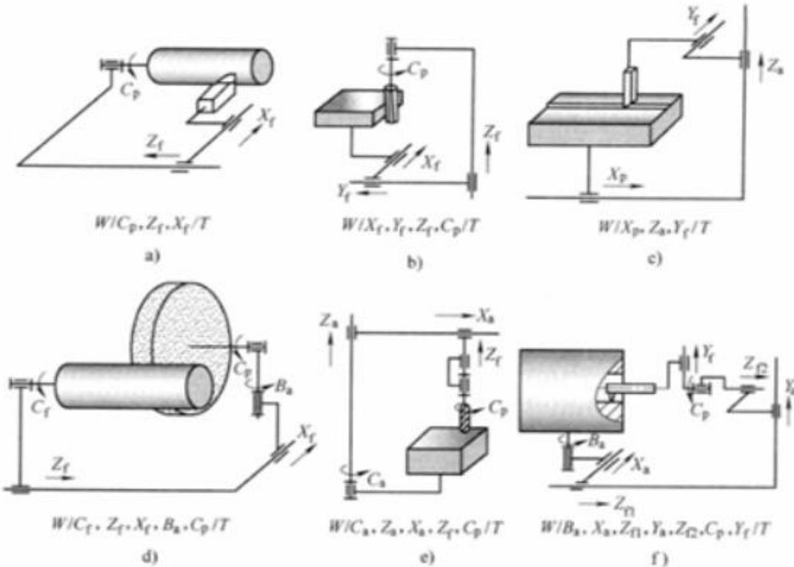

# 机械制造装备设计课后作业题：（一）

1. 机械制造装备有哪些类型？（具体到第 2 级）

2. 机械制造装备设计有哪些类型？各自的适用场合是什么？

3. 设计的评价主要有哪些？各自的核心思想是什么？

4. 工件表面的形成方法主要有哪几种？并各举一例代表性加工方法。

5. 机床低速爬行的形成原因是什么，如何改进？

6. 机床运动功能式的含义是什么？列举 2 例。

7. 运动原理图和传动原理图的区别是什么？

8. 分析下图所示各种机床的运动原理图，说明各个运动的所属类型、作用。

  
图2.4机床运动原理图