# 2023 年 08 月 31 日函数的零点与方程的根

# 一．函数的零点与方程根的关系（共 17小题）

1．若方程 $\sqrt { 3 - \frac { 3 x ^ { 2 } } { 4 } } = x + 1$ 有解，则 b 的取值范围为（ ）

A． B． C． D．[﹣2，2]

2．已知函数 $f ( x ) = \{ \begin{array} { l } { { \displaystyle 2 ^ { - \mathbf { x } } , \ \mathbf { x } \ll _ { 0 } } } \\ { { \displaystyle \mathrm { 1 n } _ { \mathbf { x } } ^ { 1 } , \ \mathbf { x } > _ { 0 } } } \end{array} , \ g ( x ) = f ( x ) - x - a .$ ，g（x）＝f（x）﹣x﹣a．若 g（x）有 2 个零点，则实数 a的最小值是（ ）

A．2 B．0 C．﹣1 D．1

3．已知函数 $\begin{array} { r } { \mathbf { \rho } _ { \mathbf { f } } \left( \mathbf { x } \right) = \displaystyle et { } { ' } \sum _ { \mathbf { x } } \mathbf { \rho } _ { \mathbf { x } } > 0 , } \end{array}$ 若直线 y＝kx 与 y＝f（x）有三个不同的交点，则实数 k的取值范围是（ ）

A． $( - \infty , \frac { 1 } { \tt \rho } )$ B． C． D．

4．设函数 $\textbf { f } ( \textbf { x } ) = \left\{ \begin{array} { l l } { \displaystyle \mathbf { x } + \mathrm { 1 n x } , ~ \mathbf { x } > 0 } \\ { \displaystyle \sin { ( \omega _ { \mathbf { x } } + \frac { \pi } { 4 } ) } , ~ - \pi \leqslant \mathbf { x } \leqslant 0 } \end{array} \right.$ 有 5 个不同的零点，则正实数 ω 的取值范围为（　　）

A． $[ \frac { 1 3 } { 4 } , \ \frac { 1 7 } { 4 } )$ B． $( \frac { 1 3 } { 4 } , \ \frac { 1 7 } { 4 } )$ C． $( { \frac { 1 3 } { 4 } } , ~ { \frac { 1 7 } { 4 } } ]$ D． $[ \frac { 1 3 } { 4 } , \ \frac { 1 7 } { 4 } ]$

5．已知不等式 $a e ^ { x } \ ( x { + } 2 ) \ < x { + } 1$ 恰有1个整数解，则实数a的取值范围为（　　）

$( \frac { 1 } { 3 \tt e } , \frac { 2 } { \tt e } )$ B． C． $( \frac { 2 } { 3 \tt e } , \frac { 1 } { 2 } )$ D． $[ \frac { 2 } { 3 \tt e } , \frac { 1 } { 2 } )$

6．函数 $\hat { \textbf { f } } ( \mathbf { x } ) = \left\{ \begin{array} { l l } { \mathbf { x } ^ { 2 } - 1 , ~ \mathbf { x } \ll 1 } \\ { \mathrm { 1 n x } , ~ \mathbf { x } > 1 } \end{array} \right.$ ，则函数 y＝f（f（x））﹣1 的零点个数为（

A．2 B．3 C．4 D．5

7．已知定义在 R 上的函数 y＝f（x）对于任意的 x 都满足 $f \left( x + 2 \right) = f \left( x \right)$ ，当﹣1≤x＜1 时，f$\mathbf { \boldsymbol { x } } ) _ { \mathbf { \lambda } } = _ { \lambda } \mathbf { \boldsymbol { 3 } } $ ，若函数 g（x）＝f（x）﹣loga|x|至少有 6 个零点，则 a 的取值范围是（　　）

$$
( 0 , ~ \frac { 1 } { 5 } ] \cup ~ ( 5 , ~ + \infty )
$$

$$
( 0 , \frac { 1 } { 5 } ) \cup [ 5 , + \infty )
$$

$$
( \frac { 1 } { 7 } , \frac { 1 } { 5 } ) \cup
$$

$$
( \frac { 1 } { 7 } , \frac { 1 } { 5 } ) \cup [ 5 , 7 )
$$

8．设函数 $\begin{array} { r } { \textbf { f } \left( \textbf { x } \right) = \left\{ \begin{array} { l l } { - \textbf { x } ^ { 2 } + 4 \mathbf { x } , \mathbf { x } \leqslant 4 , } \\ { \mid 1 \circ \mathbf { g } _ { 2 } \left( \mathbf { x } - 4 \right) \mid , \mathbf { x } > 4 , } \end{array} \right. } \end{array}$ 若关于 x 的方程 $f \left( x \right) = t$ 有四个实根 x1，x2，x3， $x _ { 4 } ( x _ { 1 } < x _ { 2 } < x _ { 3 } < x _ { 4 } )$ ，则 $\mathbf { x } _ { 1 } + \mathbf { x } _ { 2 } + 4 \mathbf { x } _ { 3 } + \frac { 1 } { 4 } \mathbf { x } _ { 4 }$ 的最小值为（　　）

A． $\frac { 4 5 } { 5 }$ B．23 C． D．24

9．已知函数 $: f ( x ) = \left\{ \begin{array} { l l } { { 2 \left. \mathbf { x } - 1 \right. , \forall \leqslant 2 } } \\ { { - \mathbf { x } ^ { 2 } + 6 \mathbf { x } - 6 , \mathbf { x } > 2 } } \end{array} \right.$ ，且 $g \ ( x ) = f \left( x \right) - a .$ ，若函数 g（x）有 3 个不同的零点，则实数 a 的取值范围为（　　）

A．（1，2） B．（1，3） C．[1，2] D．[1，3]

10．已知 f（x）是定义在 R 上的函数， $f \left( x { + } 4 \right)$ ）为奇函数， $f \ ( x { + } 5 )$ 为偶函数，当 0＜x≤1 时，f$\mathbf { \boldsymbol { x } } ) = \mathbf { \boldsymbol { x } } ^ { 3 }$ ，若函数 $g \ ( x ) \ = f \ ( x ) - m \ ( x - 2 ) \ ( m > 0 )$ ）有 5 个不同的零点，则 m 的取值范围为（　　）

A． $( \frac { 1 } { 9 } , \ \frac { 1 } { 5 } )$ B． C． $( \frac { 1 } { 7 } , \ \frac { 1 } { 3 } )$ D． $( \textstyle { \frac { 1 } { 6 } } , \ { \frac { 1 } { 2 } } )$

11．已知函数 f（x）＝ ，关于 x 的方程[f $( x ) \ ] ^ { 2 } - 2 \ ( a + 1 ) \ f \left( x \right) + a ^ { 2 } + 2 a = 0$ 至少有三个互e1nx不相等的实数解，则a的取值范围是（　　）

A． $[ 1 , \ + \infty )$

$$
\left( \mathbf { \Sigma } - \mathbf { \Sigma } \right] , \ \mathbf { \Sigma } _ { 0 } ) \ \cup \ \left( \mathbf { \Sigma } 1 , \mathbf { \Sigma } + \infty \right)
$$

$$
\left( \mathbf { \Sigma } - \infty , \mathbf { \Sigma } _ { 0 } \right) \cup \left( \mathbf { \Sigma } _ { 1 } , \mathbf { \Sigma } + \infty \right)
$$

12．已知函数 $f \left( x \right) = \left\{ { \begin{array} { l } { { \mathbf { x } } ^ { 2 } , { \mathbf { x } } { \geqslant } 0 , } \\ { \ln \left( { - } { \mathbf { x } } \right) , { \mathbf { x } } { < } 0 } \end{array} } \right.$ 若函数 $g \ ( x ) \ { = } f \left( f \left( x \right) \right) \ { - } \ a f \left( x \right) + 1$ 恰有两个零点，则a的取值范围是（ ）

A．[0，2）∪{1} B． $( 2 , \ + \infty )$ ） C．（﹣1，0） D． $\big ( \mathrm { ~ - ~ } \infty , \mathrm { ~ - ~ } 1 \big )$ ）

$\left. \mathbf { \Psi } _ { \mathbf { X } } \right. = \left\{ \begin{array} { l l } { \frac { 4 \mathbf { x } } { 1 + \mathbf { x } ^ { 2 } } , } & { \mathbf { x } \geqslant 0 } \\ { - \frac { 4 } { \mathbf { x } } , } & { \mathbf { x } < 0 } \end{array} \right.$ 13．已知 ，若 f（x）＝t 有三个不同的解 x1，x2，x3，且 $x _ { 1 } { < } x _ { 2 } { < } x _ { 3 } ,$ ，则

$\frac { 1 } { \mathbf { x } _ { 1 } } + \frac { 1 } { \mathbf { x } _ { 2 } } + \frac { 1 } { \mathbf { x } _ { 3 } }$ 的取值范围是（　　）

A．（1，+∞） B． C．（2，+∞） D．

14．已知函数 $\displaystyle { \mathrm {  ~ \omega ~ } } ( \boldsymbol { x } ) = ( \boldsymbol { x } + 1 ) \ e ^ { \boldsymbol { x } } ,$ ，若函数 $F \ ( x ) = f ^ { 2 } \ ( x ) - m f \ ( x ) \ + m - 1$ 有三个不同的零点，则实数 m 的取值范围为（　　）

A． $( - \frac { 1 } { \mathsf { e } ^ { 2 } } , 0 )$

B． $( - \frac { 1 } { \mathsf { e } ^ { 2 } } , 1 )$

C $( \mathbb { 1 } { \frac { 1 } { \mathtt { e } ^ { 2 } } } , \ 1 )$

$$
( 1 - \frac { 1 } { \mathsf { e } ^ { 2 } }
$$

15．已知函数 $: ( \mathbf { x } ) = \left\{ \begin{array} { l l } { \left| ~ 1 0 \mathbf { g } _ { 2 } \left( \mathbf { x } { - } 3 \right) ~ \right| + 1 , ~ \mathbf { x } > 3 } \\ { ~ } \\ { \left| ~ 2 ^ { \mathbf { x } } { - } 3 \right| , ~ \mathbf { x } \leqslant 3 } \end{array} \right.$ ，若关于 x 的方程 $m [ f \left( x \right) ] ^ { 2 } - 3 f \left( x \right) + 4 m =$

0 有 8 个不相等的实根，则实数 m 的取值范围为（　　）

A． $( \frac { 9 } { 1 3 } , \ \frac { 5 } { 4 } )$ B． $( \frac { 3 } { 5 } , \frac { 9 } { 1 3 } )$ C． $( \frac { 3 } { 5 } , \frac { 3 } { 4 } )$ D． $( \frac { 9 } { 1 3 } , \ \frac { 3 } { 4 } )$

16．已知函数 $\begin{array} { r } { \mathbf { \rho } ( \mathbf { x } ) = \left\{ \begin{array} { l l } { \ln \mathbf { x } + \mathbf { x } , \quad \mathbf { x } > 1 } \\ { \displaystyle 2 \mathbf { x } ^ { 2 } - \ln \mathbf { x } + \frac { \Pi } { 2 } , \quad \mathbf { \rho } , } \end{array} \right. } \end{array}$ ，若 g（x）＝f（x）﹣m 有三个零点，则实数 m的取值范围是（ ）

A． $\textstyle { \frac { 7 } { 4 } } ]$ B．（1，2] C． $( 1 , ~ \frac { 4 } { 3 } ]$ D．[1，3]

17．函数 $\textbf { f } ^ { \left( \textbf { x } \right) = { ( \frac { 1 } { \mathtt { e } } ) } ^ { \mid \mathtt { x } \mid } }$ ， $\not { D } \equiv g \ ( \chi ) = 2 \hat { f } ^ { 2 } \ ( \chi ) - \ ( 2 a + 3 ) \ f \left( x \right) + 3 a$ 有 4 个零点，则 a 的取值范围是（　　）

A．（1，2）

B． $[ \frac { 3 } { 2 } , \ 2 )$

$$
( 0 , \ \frac { 3 } { 2 } ) \cup ( \frac { 3 } { 2 } , \ 2 )
$$

$$
( 1 , ~ \frac { 3 } { 2 } ) \cup ( \frac { 3 } { 2 } , ~ 2 )
$$

# 二．函数与方程的综合运用（共 3 小题）

18．已知函数 $f \left( x \right) = l n | x - 1 | - l n | x { + } 1 | ,$ ，若存在两个不同的实数 x1，x2，使 f $\dot { \ } ( x _ { 1 } ) \ = f \ ( x _ { 2 } )$ ），则（　　）

A． $x _ { 1 } x _ { 2 } = - \mathrm { ~ 1 ~ }$ B． $x _ { 1 } x _ { 2 } { = } 1$ C． $x _ { 1 } + x _ { 2 } < - \ 2$ D． $x _ { 1 } + x _ { 2 } > 2$

19．已知函数 $f \left( x \right) = \left\{ \begin{array} { l l } { - { \mathrm { 1 n x } } , 0 < \mathrm { x } { \leqslant } 1 } \\ { { \frac { 1 } { \mathrm { x } } } , \mathrm { x } > 1 } \end{array} \right.$ ，若 $0 < a < b$ 且满足 $f \left( a \right) = f \left( b \right)$ ），则 $a f \left( b \right) + b f$

（a）的取值范围是（　　）

A．（1， $\frac { 1 } { \tt e } { \tt ^ { + 1 } }$ ） B． $( - \infty , \frac { 1 } { \tt e } + 1 ]$ C． $( 1 , \ \frac { 1 } { \tt _ { e } } + 1 ]$ D．（0， $\frac { 1 } { \tt e } { \tt ^ { + 1 } }$

20 ． 已 知 函 数 $f ( x ) = e ^ { x } - a x ^ { 2 } $ 的 定 义 域 为 $( { \frac { 1 } { 2 } } , \ 2 )$ ， 且 对$\forall \mathbf { x } _ { 1 } , \mathbf { x } _ { 2 } \in ( \frac { 1 } { 2 } , \ 2 ) , \mathbf { x } _ { 1 } \neq \mathbf { x } _ { 2 } , \frac { \textnormal { \bf f } ( \mathbf { x } _ { 1 } ) - \textnormal { \bf f } ( \mathbf { x } _ { 2 } ) } { \mathbf { x } _ { 1 } - \mathbf { x } _ { 2 } } < _ { \mathbf { x } _ { 1 } + \mathbf { x } _ { 2 } }$ 恒成立，则实数 a 的取值范围为（　　）

A． $[ \frac { e ^ { 2 } } { 4 } - 1 , ~ + \infty )$ B． C． D． $( - \infty , \frac { \textsf { e } } { 2 } - 1 )$

本卷由系统自动生成，请仔细校对后使用，答案仅供参考。

# 2023 年 08 月 31 日函数的零点与方程的根

参考答案与试题解析

# 一．函数的零点与方程根的关系（共 17 小题）

1．若方程 $\sqrt { 3 - \frac { 3 \pi ^ { 2 } } { 4 } } = x + b$ 有解，则 b 的取值范围为（ ）

A． B． C． D．[﹣2，2]

【解答】解：设 $u ^ { n } x y = \sqrt { 3 - \frac { 3 \times 2 } { 4 } } , y \geq 0 ,$ ，两边同平方得 $\mathbf { y } ^ { 2 } = 3 - \frac { 3 \mathbf { x } ^ { 2 } } { 4 } =$ ，化简得 X .2 y2 （y≥0），4 3

则其所表示的图形为椭圆 $\frac { x ^ { 2 } } { 4 } + \frac { y ^ { 2 } } { 3 } =$ 在x轴及上方部分，

则题目转化为直线 $\scriptstyle { \dot { \cdot } } y = x + b$ 与上述图形有交点，

设椭圆的右端点为A，易得其坐标为（2，0），

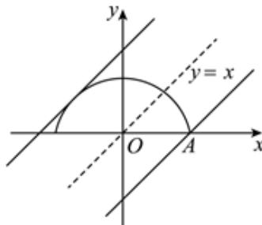

当直线 $y = x + b$ 与半椭圆相切时，显然由图得 $b > 0$ ，

联立 $\scriptstyle { \left\{ \begin{array} { l l } { \mathbf { y } = \mathbf { x } + \mathbf { b } } \\ { 3 \mathbf { x } ^ { 2 } + 4 \mathbf { y } ^ { 2 } = 1 2 } \end{array} \right. }$ ，得 $\stackrel { \exists } { \scriptscriptstyle { \uparrow } } 7 x ^ { 2 } + 8 b x + 4 b ^ { 2 } - 1 2 = 0 ,$ ，

则Δ＝（8b）2﹣4×7×（4b2﹣12）＝0，

化简得 $b ^ { 2 } = 7 ,$ ，解得 $b = \sqrt { 7 } \equiv a - \sqrt { 7 } ( \frac { \sqrt { 7 } } { 1 1 } )$ ），

当直线 $y = x + b$ 经过点 A（2，0）时，得 $0 = 2 + b \mathrm { ~ } _ { \cdot }$ ，解得 $b = - 2 ,$

则 ．

故选：B．

2．已知函数 $r \left( x \right) = \left\{ \begin{array} { l l } { { 2 ^ { - \mathbf { x } } , } } & { { \mathbf { x } \leqslant 0 } } \\ { { \displaystyle \mathrm { 1 n } \frac { 1 } { \mathbf { x } } , } } & { { \mathbf { x } > 0 } } \end{array} \right.$ ，g $\operatorname { \rho } ( x ) = f \left( x \right) \ - x - a .$ ．若 g（x）有 2 个零点，则实数 a

的最小值是（　　）

A．2 B．0 C．﹣1 D．1

【解答】解： $ { \underset { \smile } { \wedge } } g ( x ) = 0$ 可得 $f \left( x \right) = x + a ,$ ，

当 x≤0 时， ${ \mathfrak { f } } \left( { \mathfrak { x } } \right) = 2 ^ { - \mathbf { x } } = ( { \frac { 1 } { 2 } } ) ^ { \mathbf { x } } ,$

当 x＞0 时， ${ \underset { \mathbf { r } } { \mathbf { \rho } } } ( \mathbf { \rho } _ { \mathbf { x } } ) = 1 { \underset { \mathbf { x } } { \mathbf { \rho } } } { \frac { 1 } { \mathbf { x } } } { = } { - } 1 { \_ { \mathrm { n } } } { \mathbf { x } } ^ { | }$ 的图象与 $y = l n x$ 关于 x 轴对称，

所以作出函数 $y { = } f \left( x \right)$ 与函数 $y = x + a$ 的图象如下图所示：

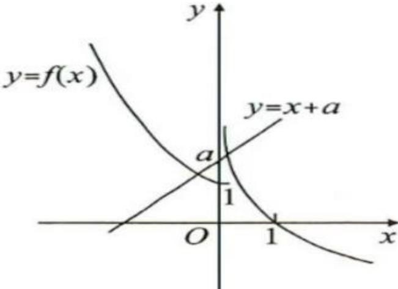

由上图可知，当 a≥1 时，函数 $y { = } f \left( x \right)$ ）与函数 $y = x + a$ 的图象有 2 个交点，

此时，函数 $\scriptstyle \cdot y = g ( x )$ ）有 2 个零点，

因此，实数 a 的取值范围是[1，+∞），

即实数a的最小值为1

故选：D

3．已知函数 $\left. \mathbf { x } \right. = \left\{ \begin{array} { l l } { \mathrm { 1 n } \mathbf { x } , ~ \mathbf { x } > 0 , } \\ { - \mathbf { x } ^ { 2 } - \mathbf { x } , ~ \mathbf { x } \ll 0 , } \end{array} \right.$ 若直线 $y = k x  y = f ( x )$ ）有三个不同的交点，则实数 k的取值范围是（ ）

本卷由系统自动生成，请仔细校对后使用，答案仅供参考。

A． $( - \infty , \frac { 1 } { e } )$ B． $( - 1 , \ \frac { 2 } { \tt e } )$ C． D．【解答】解： $\mathrm { i } \stackrel { n } { \times } y = l n x \stackrel { \left. } { \right. } y = k x$ 相切于点 $( x _ { 0 } , \ l n x _ { 0 } )$ ，

$$
\left. \vert \mathfrak { I } \right. \left. k = y ^ { \prime } \right. \vert _ { x = x 0 } = \frac { 1 } { \mathbf { x } _ { 0 } } = \frac { \ln \mathbf { x } _ { 0 } } { \mathbf { x } _ { 0 } } ,
$$

解得 $x _ { 0 } = e ,$ ，此时 $k { = } \frac { 1 } { \mathsf { e } } ,$ ，

由 $\scriptstyle 1 \left\{ \begin{array} { l } { \scriptstyle \mathrm { y = k x } } \\ { \scriptstyle \mathrm { y = - x } ^ { 2 } - x , \ x \ll 0 } \end{array} \right.$ ，得 x2+（k+1）x＝0，，

由 $\Delta = 0$ 可得 $k = - 1$ ，此时切点为（0，0），

作出函数 y＝kx 与 y＝f（x）的图象如图，

由图象可知， $\ Y - \ 1 < k \leqslant 0$ 或 $k { = } \frac { 1 } { \mathsf { e } } \mathbb { H } \mathbb { . }$ ，

直线 $y = k x  y = f ( x )$ 有三个不同的交点，

故选：C．

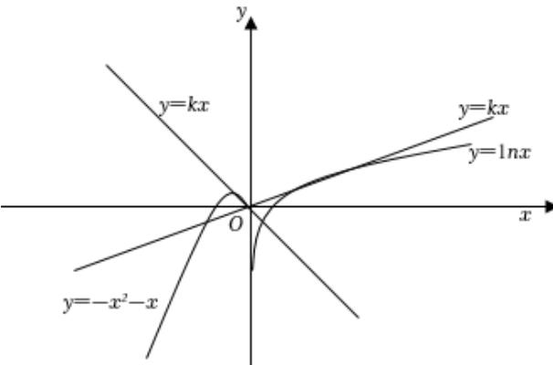

4．设函数 $\textbf { f } ( \textbf { x } ) = \left\{ \begin{array} { l l } { \displaystyle \mathbf { x } + \mathrm { 1 n } \mathbf { x } , ~ \mathbf { x } > 0 } \\ { \displaystyle \sin { ( \omega _ { \mathbf { x } } + \frac { \pi } { 4 } ) } , ~ - \pi \leqslant \mathbf { x } \leqslant 0 } \end{array} \right.$ 有 5 个不同的零点，则正实数 ω 的取值范围为（　　）

A． $[ \frac { 1 3 } { 4 } , \ \frac { 1 7 } { 4 } )$ ） B．（ ， ） 44 C．（ ， ] D． $[ \frac { 1 3 } { 4 } , \ \frac { 1 7 } { 4 } ]$

【解答】解：由题可得，当 x＞0 时， $f \left( x \right) = x + l n x$ ，显然单调递增， $\mathrm { ~ H ~ } f ( \frac { 1 } { 1 0 } ) = \frac { 1 } { 1 0 } - l n 1 0$ $< 0 , \ f \left( 2 \right) = 2 + l n 2 > 0 ,$ ，

所有此时 f（x）有且只有一个零点，所有当﹣π≤x≤0 时， $f \left( x \right) = \sin \left( \omega x + \frac { \pi } { 4 } \right)$ ）有 4 个零点，

令 f ${ \ v O } ^ { \ v O } ( { \ v x } ) = { \ v 0 } ,$ ，即 $\omega x + \frac { \pi } { 4 } = k \pi$ ，k∈Z，解得 $x { = } \frac { - \frac { \pi } { 4 } { + } \mathtt { k } \pi } { \mathfrak { G } } ,$ ，k∈Z，

由题可得﹣π≤x≤0区间内的4个零点分别是 $k { = } 0 , \quad - \ 1 , \quad - \ 2 , \quad - \ 3 ,$ ，

所以﹣π 即在 $k { = } - 3$ 与 k＝﹣4 之间，

即 $\begin{array} { r } { \left\{ \begin{array} { l l } { \displaystyle \frac { - \frac { \pi } { 4 } - 3 \pi } { \omega } \geqslant - \pi } \\ { \displaystyle \frac { - \pi } { 4 } - 4 \pi } \\ { \displaystyle \omega } < - \pi \right.} \end{array}   \end{array}$ ，解得 $\frac { 1 3 } { 4 } { \leq } \omega < \frac { 1 7 } { 4 } .$

故选：A

5．已知不等式 $\stackrel { \bullet } { \cup } a e ^ { x } \ ( x + 2 ) \ < x + 1$ 恰有1个整数解，则实数a的取值范围为（　　）

A． $( \frac { 1 } { 3 \tt e } , \frac { 2 } { \tt e } )$ B． $[ \frac { 1 } { 3 \tt e } , \frac { 2 } { \tt e } )$ C． D． $[ \frac { 2 } { 3 \tt e } , \frac { 1 } { 2 } )$

【解答】解：由不等式 $a e ^ { x } \ ( x { + } 2 ) \ < x { + } 1$ ，可得 $a \left( x + 2 \right) < \frac { x + 1 } { e ^ { x } } ,$

$$
g \ ( \boldsymbol { x } ) \ = a \ ( \boldsymbol { x } + \boldsymbol { 2 } ) , \ \mathrm { ~ f ~ } ( \boldsymbol { \textbf { x } } ) = \frac { \boldsymbol { x } + \boldsymbol { 1 } } { \mathrm { ~ e ~ } ^ { \mathrm { ~ \scriptsize ~ x ~ } } } ,
$$

则 $( x ) = \frac { - x } { e ^ { x } } ,$

当 $x { < } 0$ 时，f′（x）＞0，f（x）在 $( \mathbf { \alpha } - \infty ,$ ，0）上单调递增，

当 $x { > } 0$ 时， $\begin{array} { r l } { f ^ { \prime } } & { { } ( x ) < 0 , \ f \left( x \right) } \end{array}$ 在 $( 0 , \ + \infty )$ ）上单调递减，

当 $x { = } 0$ 时， $f \left( x \right)$ 取极大值 1

又 $f \left( { \bf { \bar { \Phi } } } - 1 \right) = 0 ,$ ，且 x＞0 时， $f \left( x \right) > 0 ,$ ，

直线 $g \ ( x ) = a \ ( x { + } 2 )$ ）恒过点（﹣2，0），

当 a＞0 时，作出 $g \ ( x ) = a \ ( x + 2 )$ 与 $( \mathbf { \nabla _ { x } } ) = \frac { \mathbf { x } + 1 } { \mathbf { e } ^ { \mathbf { x } } }$ 的图像如下所示，

本卷由系统自动生成，请仔细校对后使用，答案仅供参考。

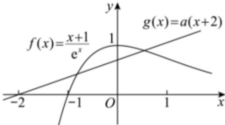

$g \ ( x ) \ { < } f \left( x \right)$ ）恰有 1 个整数解，只需要满足 $\vdots \left\{ \begin{array} { l l } { \mathtt { f } \left( 0 \right) \ > \mathtt { g } \left( 0 \right) } \\ { \mathtt { f } \left( 1 \right) \leqslant \mathtt { g } \left( 1 \right) } \end{array} \right. ,$

解得 $\frac { 2 } { 3 \rho } \leq a < \frac { 1 } { 2 } ,$

当 a≤0 时，显然 $g \ ( x ) \ { < } f \left( x \right)$ 有无穷多个整数解，不满足条件，

所以 a 的取值范围为 $[ \frac { 2 } { 3 \tt e } , \frac { 1 } { 2 } )$

故选：D．

6．函数 $\hat { \textbf { f } } ( \mathbf { x } ) = \left\{ \begin{array} { l l } { \mathbf { x } ^ { 2 } - 1 , ~ \mathbf { x } \leqslant 1 } \\ { \mathrm { 1 n x } , ~ \mathbf { x } > 1 } \end{array} \right.$ ，则函数 $_ { y = f } \left( f \left( x \right) \right)$ ﹣1的零点个数为（　　）

A．2 B．3 C．4 D．5

【解答】解： $\scriptstyle { \hat { \vec { \mathbf { \tau } } } } ( t = f \mid ( { \boldsymbol { \mathbf { \mathit { x } } } } )$ ， $\| \| _ { f } \left( t \right) = 1$ ，当t≤1时，

由 $t ^ { 2 } - 1 = 1$ ，可得 $t = - \sqrt { 2 } \equiv \sqrt { 2 } t = \sqrt { 2 }$ （舍去）；

当 t＞1 时，由 $l n t { = } 1$ 可得 $t = e ,$ ，所以 $. f \left( t \right) = 1$ 的两根为 $\sf t _ { 1 } = - \sqrt { 2 } , t _ { 2 } = e ,$ 则 $\mathtt { f } \left( \mathtt { x } \right) = - \sqrt { 2 } \exists \vec { \chi } f \left( x \right) = e ,$ ，

因为 f（x）在 $( \mathbf { \alpha } - \infty ,$ ，0）上单调递减，在（0，+∞）上单调递增，

所以 $f \left( x \right) \geqslant f \left( 0 \right) = - 1$ ，若 $( \mathbf { x } ) = - { \sqrt { 2 } } ,$ ，易知方程无解，

若 $f \left( x \right) = e ,$ ，当 x≤1 时，

由 $\mid x ^ { 2 } - 1 = e ,$ ，得 $\scriptstyle \mathbf { x } = - { \sqrt { \mathsf { e } + 1 } }$ 或 $\scriptstyle \mathbf { x } = { \sqrt { \mathsf { e } + 1 } }$ （舍去），

此时方程有唯一的解；

当 x＞1 时，由 $l n x { = } e ,$ ，得 $x { = } e ^ { e } ,$ ，此时方程有唯一的解，

综上所述可知函数 $y = f \ ( f \ ( x ) ) - 1$ 的零点个数为 2 个

故选：A．

7．已知定义在 R 上的函数 $y { = } f \left( x \right)$ ）对于任意的 x 都满足 $f \left( x + 2 \right) = f \left( x \right)$ ， $\ Ydashv 1 \leqslant x < 1$ 时，f$( x ) = x ^ { 3 } ,$ ，若函数 $g \ ( x ) \ = f \left( x \right) - \log a $ |x|至少有 6 个零点，则 a 的取值范围是（　　）

$$
( 0 , ~ \frac { 1 } { 5 } ] \cup ~ ( 5 , ~ + \infty )
$$

B． $\frac { 1 } { 5 } ) \cup [ 5 , ~ + \infty )$

$$
( \frac { 1 } { 7 } , \frac { 1 } { 5 } ) \cup
$$

D． ∪[5，7）

【解答】解： $\boxplus f \left( x + 2 \right) = f \left( x \right)$ ）知 f（x）是周期为 2 的周期函数，

函数 $g \ ( x ) \ = f \ ( x ) \ - \log _ { a } \left| x \right. $ |至少有 6 个零点等价于函数 $\scriptstyle { y = f \left( x \right) }$ 与 g $\mathbf { \phi } ( x ) \mathbf { \phi } = \log _ { a } ( \mathbf { \phi } _ { \mathrm { ~ } }$ a|x|的图象至少有 6 个交点，

①当 a＞1 时，画出函数 $\scriptstyle  \{ y = f \ ( x ) $ ）与 ${  { g } } \left( x \right) = \log _ { c }$ |x|的图象如图所示，

根据图象可得 $g \ ( 5 ) = \log _ { a } 5 < 1$ ，即 $a > 5$

本卷由系统自动生成，请仔细校对后使用，答案仅供参考。

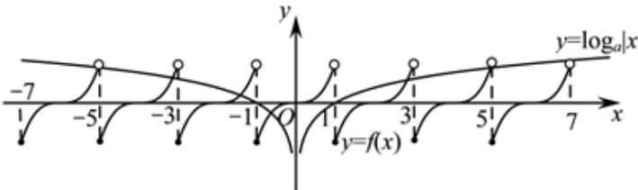

②当 $0 { < } a { < } 1$ 时，画出函数 $\scriptstyle \cdot y = f \left( x \right)$ ）与 ${ \textbf { \textsf { y } } } ( x ) = \log _ { a } $ |x|的图象如图所示，

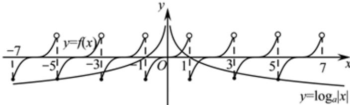

根据图象可得 $g \ ( \ - \ 5 ) = \log _ { a } 5 \geqslant - \ 1 ,$ ，即 $0 < a \leqslant \frac { 1 } { 5 }$

综上所述，a 的取值范围是 $( 0 , \frac { 1 } { 5 } ] \cup ( 5 , + \infty )$

故选：A．

8．设函数 $\vdots \left( \mathbf { x } \right) = \left\{ \begin{array} { l l } { - \mathbf { x } ^ { 2 } \mathbf { + } 4 \mathbf { x } , \mathbf { x } { \leqslant } 4 , } \\ { \mid 1 \mathsf { o g } _ { 2 } \left( \mathbf { x } \mathbf { - } 4 \right) \mid , \mathbf { x } { > } 4 , } \end{array} \right.$ 若关于 x 的方程 $f \left( x \right) = t$ 有四个实根 x1，x2，

x3，x4（x1＜x2＜x3＜x4），则 X4 的最小值为（　　）

A． B．23 C． D．24

【解答】解：作出函数 $\begin{array} { r } { \mathbf { \rho } ( \mathbf { \rho } _ { \mathbf { x } } ) = \left\{ \begin{array} { l l } { - \mathbf { x } ^ { 2 } + 4 \mathbf { x } , \mathbf { \rho } _ { \mathbf { x } } \ll 4 , } \\ { \mid 1 \mathbf { g } _ { 2 } \mathbf { \rho } ( \mathbf { \rho } _ { \mathbf { x } } - 4 ) \mathbf { \rho } \mid } \end{array} \right. } \end{array}$ 的图象如图所示：$_ { \mathrm { { X } } } > 4 ,$

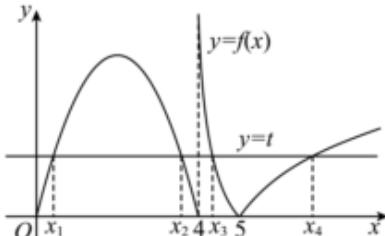

由图可知， $x _ { 1 } + x _ { 2 } = 4 ,$ ，由|log2 $\left( x - 4 \right) \mid = f \left( 2 \right) = 4 ,$ ，可得 $\mathbf { x } = \frac { 6 5 } { 1 6 } \div \textcircled { \div } x = 2 0 ,$

所以 $5 < x _ { 4 } < 2 0 ,$

又因为 $\log _ { 2 } { ( x _ { 3 } - 4 ) } + \log _ { 2 } { ( x _ { 4 } - 4 ) } = 0 ,$

所以 $( x _ { 3 } - 4 ) \ ( x _ { 4 } - 4 ) \ = 1$ ，

$$
{ \bf x } _ { 3 } = \frac { 1 } { { \bf x } _ { 4 } - 4 } + 4 ,
$$

所

$$
4 \mathbf { x } _ { 3 } + \frac { 1 } { 4 } \mathbf { x } _ { 4 } = 4 ( \frac { 1 } { \mathbf { x } _ { 4 } - 4 } + 4 ) + \frac { 1 } { 4 } \mathbf { x } _ { 4 } = \frac { 4 } { \mathbf { x } _ { 4 } - 4 } + \frac { 1 } { 4 } ( \mathbf { x } _ { 4 } - 4 ) + 1 7 \geqslant 2 \sqrt { \frac { 1 } { 4 } \left( \mathbf { x } _ { 4 } - 4 \right) \cdot \frac { 4 } { \mathbf { x } _ { 4 } - 4 } } + 1 7 = 1 9 ,
$$

当且仅当 $1 \frac { 1 } { 4 } ( x _ { 4 } - 4 ) = \frac { 4 } { x _ { 4 } - 4 } ,$ ，即 $x _ { 4 } = 8$ 时取等号，

$\mathbf { x } _ { 1 } + \mathbf { x } _ { 2 } + 4 \mathbf { x } _ { 3 } + \frac { 1 } { 4 } \mathbf { x } _ { 4 }$ 的最小值为 $4 + 1 9 = 2 3$ ．

故选：B．

9．已知函数 $f \left( x \right) = \left\{ \begin{array} { l l } { { 2 ^ { \left. { \bf x } - 1 \right. } , \forall \leqslant 2 } } \\ { { - \bf x } ^ { 2 } { + } { \ominus } { \bf x } { - } { \ominus } { \bf , } { \bf x } { > } { 2 } } \end{array} \right.$ ，且 $g \ ( x ) = f \left( x \right) - a ,$ ，若函数 $g \ ( x )$ ）有 3 个不同的零点，则实数a的取值范围为（　　）

A．（1，2） B．（1，3） C．[1，2] D．[1，3]

【解答】解：函数 $f \left( x \right) = \left\{ \begin{array} { l l } { { 2 ^ { \left| x - 1 \right| } , \hfill ~ \mathrm { x } \leqslant 2 } } \\ { { - \hfill \mathrm { x } ^ { 2 } + \hfill \mathrm { 6 x } - \hfill \mathrm { 6 } , \hfill ~ \mathrm { x } > 2 } } \end{array} , \right.$

当 x≤2 时， $f \left( x \right) = 2 ^ { \left| x - 1 \right| } ;$ ，它的图象可以看成是由 $y = 2 ^ { | x | }$ |的图象向右平移 1 个单位得到的，当 $x { > } 2$ 时， $f \left( x \right) = - x ^ { 2 } + 6 x - 6 .$ ，它的图象是一个对称轴为 $x = 3 ,$ ，开口向下的抛物线，作出函数 $f \left( x \right)$ 的图象如图所示，

函数 $g \ ( x ) = f \left( x \right) - a$ 有 3 个不同的零点，即函数 f（x）的图象与直线 $_ { ( y = a }$ 有 3 个不同的交点，

当 $x { = } 1$ 时，函数 $f \left( x \right)$ 有极小值 $f \left( 1 \right) = 1$ ，

当 $x { = } 3$ 时，函数 f（x）有极大值 $f \left( 3 \right) = 3$

所以实数a的取值范围为（1，3）

故选：B．

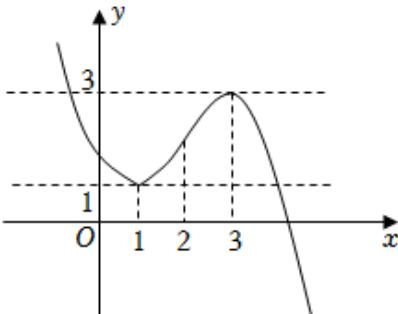

A． $( \frac { 1 } { 9 } , \ \frac { 1 } { 5 } )$ B． C． D． $( \textstyle { \frac { 1 } { 6 } } , \ { \frac { 1 } { 2 } } )$

10．已知 f（x）是定义在 R 上的函数， $f \ ( x { + } 4 )$ ）为奇函数， $f \ ( x { + } 5 )$ 为偶函数，当 0＜x≤1 时，f$( x ) = x ^ { 3 }$ ，若函数 $g \ ( x ) = f \left( x \right) - m \ \left( x - 2 \right) \ \left( m > 0 \right)$ ）有 5 个不同的零点，则 m 的取值范围为（　　）

【解答】解：因为 f（x+5）为偶函数，所以曲线 y＝f（x）关于直线 $x { = } 5$ 对称， $f \left( 1 0 - x \right) =$ $f \left( x \right) ,$ ，

因为 $f \ ( x { + } 4 )$ 为奇函数，所以曲线 $\scriptstyle ( y = f \ ( x )$ 关于点（4，0）对称， $f \left( 8 - x \right) = - f \left( x \right)$ ）．所以 $f \left( 8 - \mathbf { \partial } \left( x - 2 \right) \right) = - f \left( x - 2 \right) = f \left( x \right) ,$ ，则 $\parallel f ( x - 2 ) = - f ( x )$ ，

所以 $f \left( x - 4 \right) = f \left( x \right) ,$ ，即 $f \left( x + 4 \right) = f \left( x \right)$

则 f（x）是以 4 为一个周期的周期函数，

所以曲线 $y { = } f \left( x \right)$ ）关于点（0，0）对称（f（x）为奇函数），且关于直线 $x { = } 1$ 对称，

因为 f（x）为奇函数，所以 $f \left( 0 \right) = 0$ ，当 $0 { < } x { \leqslant } 1$ 时， $f \left( x \right) = x ^ { 3 }$ ，

所以当 $\scriptstyle - \ 1 \leqslant x < 0$ 时， $f \left( x \right) = x ^ { 3 }$ ，所以 $\ Ydashv \ 1 \leqslant x \leqslant 1$ 1 时， $f \left( x \right) = x ^ { 3 }$

根据周期性可知，曲线 $y { = } f \left( x \right)$ 与直线 $\scriptstyle \gamma = m \ ( x - 1 0 )$ ）有5个交点，

则曲线 $y { = } f \left( x \right)$ ）与直线 $y = m \ ( x - 2 )$ ）有 5 个交点，根据对称性，

在同一坐标系中，作出函数 $y { = } f \left( x \right)$ ）的图像与直线 $\scriptstyle { y = m } \ ( x - 2 )$ ），如图所示

由图像可知， $\frac { 1 } { 9 - 2 } < \pi < \frac { 1 } { 5 - 2 } ,$ ，即 $\scriptstyle { \mathbb { I } } { \frac { 1 } { 7 } } < _ { \mathtt { m } } < { \frac { 1 } { 3 } } .$

故选：C

本卷由系统自动生成，请仔细校对后使用，答案仅供参考。

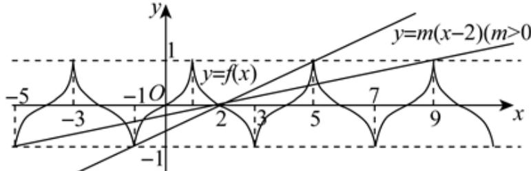

11．已知函数 $f \left( x \right) = \frac { \mathbf { x } } { \mathsf { e l n x } } ,$ ，关于 x 的方程[f $( x ) \ ] ^ { 2 } - 2 \ ( a + 1 ) \ f \left( x \right) + a ^ { 2 } + 2 a = 0$ 至少有三个互不相等的实数解，则a的取值范围是（　　）

A． $[ 1 , \ + \infty )$

$$
\left( \mathbf { \Sigma } - \mathbf { \Sigma } \right] , \ \mathbf { \Sigma } _ { 0 } ) \ \cup \ \left( \mathbf { \Sigma } 1 , \mathbf { \Sigma } + \infty \right)
$$

C $\left( \ - \ 1 , \ 0 \right) \ \cup [ 1 , \ + \infty )$ D $\left( \mathbf { \Sigma } - \infty , \mathbf { \Sigma } _ { 0 } \right) \cup \left( \mathbf { \Sigma } _ { 1 } , \mathbf { \Sigma } + \infty \right)$ ）

【解答】解：已知函数 $f \left( x \right) = \frac { \mathbf { x } } { \mathsf { e l n x } } , \ x { > } 0$ 且 x≠1，

$$
\mathbf { \rho } ( x ) \mathbf { \rho } = \frac { 1 } { \mathsf { e } } \times \frac { \mathbf { 1 } \mathrm { n } \mathbf { x } ^ { - 1 } } { \left( \mathrm { 1 n } \mathbf { x } \right) ^ { 2 } } ,
$$

令 f′ $( x ) = 0 ,$ ，则 $x { = } e ,$

当 x∈（0，1）和（1，e）时， $\begin{array} { r l } { f ^ { \prime } } & { { } ( x ) < 0 , \ f \left( x \right) } \end{array}$ 单调递减；

当 $x \in \ ( e , \ + \infty )$ ）时， $\begin{array} { r l } { f ^ { \prime } } & { { } ( x ) \ > 0 , \ f \left( x \right) } \end{array}$ 单调递增；

$$
f \left( e \right) = \frac { \textsf { e } } { \mathsf { e } \bot \mathsf { n } \mathsf { e } } { } ^ { = 1 , }
$$

当 x∈（0，1）时，f（x）＜0，x∈（1，e）时， $f \left( x \right) \geqslant 1$ ，

$$
[ f \ ( x ) \ ] ^ { 2 } - 2 \ ( a + 1 ) \ f \ ( x ) \ + a ^ { 2 } + 2 a = 0 { \Rightarrow } [ f \ ( x ) \ - a ] [ f \ ( x ) \ - a - 2 ] { = } 0 ,
$$

$$
\therefore f \left( x \right) = a ,
$$

$$
f \left( x \right) = a { + } 2 ,
$$

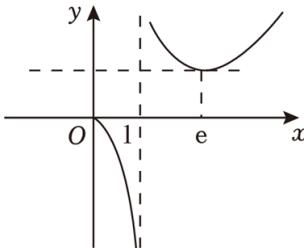

要使[f $r ( x ) ] ^ { 2 } - 2 ( a + 1 ) f ( x ) + a ^ { 2 } + 2 a = 0$ 至少有三个互不相等的实数解，则 $\| _ { \mathsf { a } > 1 } ^ { \mathsf { a } + 2 > 1 }$ ，解得 a＞1，有 4 个根，

本卷由系统自动生成，请仔细校对后使用，答案仅供参考。

，解得 a＝1，有 3 个根，

${ \binom { \bar { \mathsf { a } } + 2 > 1 } { \bar { \mathsf { a } } < 0 } } ,$ ，解得 $\mathrm { ~ - ~ } 1 { < } a { < } 0 ,$ ，有3个根，

综上所述，a∈（﹣1，0）∪[1，+∞）

故选：C．

12．已知函数 $f \left( x \right) = \left\{ { \bf x } ^ { 2 } , \bf { x } \gg 0 , \right. \nonumber$ 若函数 $g \ ( x ) \ = f \left( f \left( x \right) \right) \ - a f \left( x \right) + 1$ 恰有两个零点，则a的取值范围是（ ）

A．[0，2）∪{1} B．（2，+∞） C．（﹣1，0） D． $\big ( \mathrm { ~ - ~ } \infty , \mathrm { ~ - ~ } 1 \big )$

【解答】解：作出 f（x）的图象如图所示，当 y＜0 时， $\scriptstyle { y = f \ ( x ) }$ 有一解，

当 y≥0 时， $\scriptstyle { y = f \ ( x ) }$ ）有二个解，

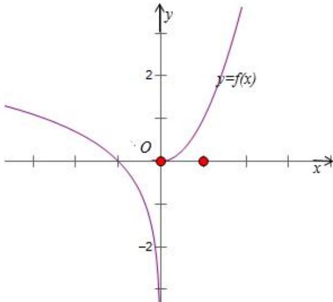

$$
g \ ( x ) \ = f \left( f \left( x \right) \right) \ - a f \left( x \right) + 1 ,
$$

令 t＝f（x），g（t）＝f（t）﹣at+1，

即 ${ \boldsymbol { f } } \left( { \boldsymbol { t } } \right) = { \boldsymbol { a } } { \boldsymbol { t } } - 1 ,$ 作函数 $y = f \ ( t ) \ \stackrel { } { \to } \ y = a t - 1 .$

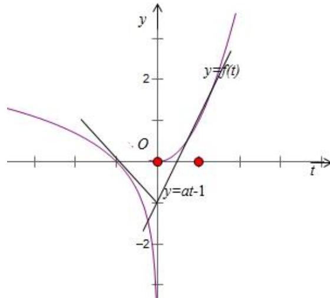

直线 $\scriptstyle { y = a t - 1 }$ 恒过定点 $\ : \ : \ : \ : \left( 0 , \ : \ : \ : - 1 \right)$ ，

当 a≥0 时，直线 $f \left( t \right) = a t -$ 1 有一个大于等于 0，一个小于 0 的根或只有一个小于 0 的根，由 $y { = } f \left( x \right)$ ）可知 $g \ ( x ) = f \left( f \left( x \right) \right) \ - a f \left( x \right) + 1$ 恰有三个零点或只有一个零点，不符合题意，当 $a < 0 1$ 时，直线 $\scriptstyle { y = a t - 1 }$ 与 y＝f（t）相切时，若 $a = - 1$ ，此时 f $\dot { \mathbf { \rho } } ( t ) = a t \cdot \mathbf { \rho } 1$ 只有一个﹣1的根，

由 $y { = } f \left( x \right)$ ）可知 $g \ ( x ) \ = f \left( f \left( x \right) \right) - a f \left( x \right)$ ）+1 恰有一个零点，不符合题意，

当 $a < - 1$ 时， $f \left( t \right) = a t - 1$ 没有根，由 $y { = } f \left( x \right)$ 可知 $g \ ( x ) \ = f \left( f \left( x \right) \right) - a f \left( x \right)$ ）+1 没有零点，不符合题意，当 $\textstyle - \ 1 < a < 0$ 时， $f \left( t \right) = a t - 1$ 有两个小于 0 的根，由 ${ \mathfrak { g } } { \mathfrak { p } } { = } { \mathfrak { f } } \left( { \mathfrak { x } } \right)$ ）可知 g $\underline { { \boldsymbol { \mathsf { \Pi } } } } \mathbf { \Pi } ( \boldsymbol { x } ) \mathbf { \Pi } = \boldsymbol { \mathsf { f } } \mathbf { \Pi } \left( \boldsymbol { f } \mathbf { \Pi } ( \boldsymbol { x } ) \right) \mathbf { \Pi } - \boldsymbol { a } \boldsymbol { f } \mathbf { \Pi } ( \boldsymbol { x } )$ +1 恰有两个零点，符合题意，

∴a的取值范围是（﹣1，0）

故选：C．

13．已知 $\left( { \bf { x } } \right) = \left\{ \begin{array} { l l } { \displaystyle \frac { 4 { \bf { x } } } { { \bf { 1 } } + { \bf { x } } ^ { 2 } } , ~ { \bf { x } } \geqslant 0 } \\ { \displaystyle \frac { 4 } { \bf { x } } , ~ { \bf { x } } < 0 } \end{array} \right.$ ，若 f（x）＝t 有三个不同的解 x1，x2，x3，且 $x _ { 1 } { < } x _ { 2 } { < } x _ { 3 } ,$ ，则$\frac { 1 } { \mathbf { x } _ { 1 } } + \frac { 1 } { \mathbf { x } _ { 2 } } + \frac { 1 } { \mathbf { x } _ { 3 } }$ 的取值范围是（ ）

A．（1，+∞） B． $( \frac { 3 } { 2 }$ C．（2，+∞） D． $( \frac { 5 } { 2 } , + \infty )$

本卷由系统自动生成，请仔细校对后使用，答案仅供参考。

【解答】解：当 x＜0 时， $\mathrm { ~ f ~ } ( \mathbf { \sigma } _ { \mathbf { x } } ) = - \frac { 4 } { \mathbf { x } } \mathrm { \# } \mathbf { \overleftarrow { \mathrm { \mathbf { x } } } } \mathrm { ~ ( ~ - ~ } \infty , \mathrm { ~ 0 ~ } )$ ）上单调递增，函数 $f \left( x \right)$ 的取值集合为$( 0 , \ + \infty ) ,$ ，

当 x≥0 时， ${ \textnormal { f } } { \big ( } \mathbf { x } { \big ) } = { \frac { 4 \mathbf { x } } { { 1 + \mathbf { x } } ^ { 2 } } } , ~ f ^ { \mathbf { \varepsilon } } ( 0 ) = 0 ,$ ，当 x＞0 时， $\frac { \texttt { f } ( \texttt { x } ) = \frac { 4 } { \texttt { 1 } } } { \frac { \texttt { 1 } } { \texttt { x } } + \texttt { x } } , ~ \stackrel { \ll } { \stackrel { \ll } { \prec } } \mathtt { y } _ { \texttt { x } } ^ { = \frac { 1 } { \texttt { x } } + \texttt { x } , ~ \texttt { x } > 0 } ,$ ，显然函数 $\mathbf { y } = \frac { 1 } { \mathbf { \check { x } } } + \mathbf { \check { x } } ^ { \mathrm { \# } } \mathbf { \Psi } ^ { ( 0 , \mathrm { \# } ) }$ ）上单调递减，在（1，+∞）上单调递增，因此函数 f（x）在（0，1）上单调递增，在 $( 1 , \ + \infty )$ ）上单调递减， $f \left( 1 \right) = 2 ,$ ，于是当 x≥0 时，函数 $\cdot f \left( x \right)$ 的取值集合为[0，2]，且当 x＞1 时，恒有 f（x）＞0，由 $f \left( x \right) = t$ 有三个不同的解 $x _ { 1 } , \ x _ { 2 } , \ x _ { 3 } , \ \textcircled { \div } x _ { 1 } < x _ { 2 } < x _ { 3 } ,$ ，得 0＜t＜2，且 $\frac { 4 } { \tt { \tt { x } } _ { 1 } } = \tt { \tt t }$ ，x2，x3 是方$\frac { \mathrm { a } } { \mathrm { a } } - \frac { 4 \mathrm { x } } { 1 + \mathrm { x } ^ { 2 } } = 1$ 的不等实根，

由 $\frac { 4 x } { 1 + x ^ { 2 } } = 1$ 得：tx2﹣4x+t＝0，则有 +x3 4 t ，而 ，x1

因 此 $- \frac { 1 } { x _ { 1 } } + \frac { 1 } { x _ { 2 } } + \frac { 1 } { x _ { 3 } } = - \frac { 1 } { x _ { 1 } } + \frac { x _ { 2 } + x _ { 3 } } { x _ { 2 } x _ { 3 } } = \frac { 1 } { 4 } + \frac { 4 } { t } = \frac { 1 } { 4 } ( t + \frac { 1 6 } { t } )$ ， 由 对 勾 函 数 知 函 数$\textrm { g ( t ) } = \frac { 1 } { 4 } ( t + \frac { 1 6 } { \textrm { t } }$ 在（0，2）上单调递减，

即有 $\mathsf { g } \left( \mathtt { t } \right) \gg \mathsf { g } \left( 2 \right) = \frac { 5 } { 2 } ,$ ，所以 $\frac { 1 } { \mathbf { x } _ { 1 } } + \frac { 1 } { \mathbf { x } _ { 2 } } + \frac { 1 } { \mathbf { x } _ { 3 } }$ 的取值范围是 $( \frac { 5 } { 2 }$ +00）.

故选：D．

14．已知函数 $\begin{array} { r } { \mathbf { \Psi } \cdot \boldsymbol { f } \left( \boldsymbol { x } \right) = \left( \boldsymbol { x } + \boldsymbol { 1 } \right) e ^ { \boldsymbol { x } } , } \end{array}$ ，若函数 $F \ ( x ) \ = f ^ { 2 } \ ( x ) \ - m f \ ( x ) \ + m - 1$ 有三个不同的零点，则实数 m 的取值范围为（　　）

A． $( - \frac { 1 } { \mathsf { e } ^ { 2 } } , 0 )$ B． $( - \frac { 1 } { \mathsf { e } ^ { 2 } } , 1 )$   
C． $( \mathsf { 1 } - \frac { \mathsf { 1 } } { \mathsf { e } ^ { 2 } } , \mathsf { 1 } )$ D． （1 1 1)U(1，+00） 2 e

【解答】解：函数 $f \left( x \right) = \left( x + 1 \right)$ ）ex 的定义域为 R，求导得 f′ $\mathbf { \Psi } ( x ) = \mathbf { \Psi } ( x + 2 ) { \mathbf { \Psi } } e ^ { x } ,$ ，当 $x < - 2$ 时，f′（x）＜0，当 x＞﹣2 时， $f ^ { \prime } ( x ) > 0 $ ，

因 此 函 数 $\textit { f } ( x )$ 在 $( \mathrm { ~  ~ { ~ - ~ } ~ } \infty \mathrm { ~ , ~  ~ { ~ - ~ } ~ } 2 \mathrm { ~ ) ~ }$ ） 上 单 调 递 减 ， 在 $( \mathrm { ~  ~ \bar { ~ } { ~ 2 ~ } ~ } , \mathrm { ~  ~ \Gamma ~ } + \infty \mathrm { ~  ~ \rho ~ } )$ ） 上 单 调 递 增 ，$\mathtt { f } \left( \mathtt { x } \right) _ { \mathtt { m i n } } = \mathtt { f } \left( - 2 \right) = - \frac { 1 } { \mathtt { e } ^ { 2 } } ,$ 且 x＜﹣1，恒有 $f \left( x \right) < 0 ,$ ，

由 F $( x ) = 0 ,$ ，得[f $( x ) - 1 ] [ f \left( x \right) - m + 1 ] = 0 ,$ ，即 $f \left( x \right) = 1$ 或 f（x）＝m﹣1，由 $f \left( x \right) =$ 1，得 $x { = } 0$ ，

于是函数 F（x）有 3 个不同零点，当且仅当方程 $f \left( x \right) = m - 1$ 有 2 个不同的解，即直线 $y = m$ $- \mid \Xi _ { \ l } y = f \left( x \right)$ 图象有 2 个公共点，

在同一坐标系内作出直线 $y = m \ - \ 1 \ \stackrel { \left. } { \right. } \ y = f \ ( x )$ 的图象，如图，观察图象知，当 $\frac { 1 } { \mathsf { e } ^ { 2 } } < \pi - 1 < 0 ,$ ， 即 $\frac { 1 } { e ^ { 2 } } < \pi$ 时，直线 $y = m \cdot 1  y = f ( x )$ ）的图象有2 个公共点，

所以实数 m 的取值范围为 $( \mathsf { 1 } - \frac { 1 } { \mathsf { e } ^ { 2 } } , \mathsf { 1 } )$

故选：C．

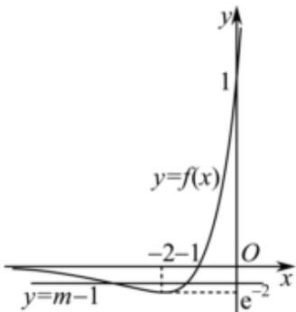

15．已知函数 $\operatorname { f } \left( \mathbf { x } \right) = \left\{ { \begin{array} { l } { \left| \ 1 \circ \mathbf { g } _ { 2 } \left( \mathbf { x } { - } 3 \right) \ \right| { + } 1 , \ \mathbf { x } > 3 } \\ { \left| \ 2 ^ { \mathbf { x } } { - } 3 \right| , \ \mathbf { x } { \leqslant } 3 } \end{array} } \right.$ ，若关于 x 的方程 $m [ f \left( x \right) ] ^ { 2 } - 3 f \left( x \right) + 4 m =$

0 有 8 个不相等的实根，则实数 m 的取值范围为（　　）

A． $( \frac { 9 } { 1 3 } , \ \frac { 5 } { 4 } )$ B． C． $( \frac { 3 } { 5 } , \frac { 3 } { 4 } )$ D． $( \frac { 9 } { 1 3 } , \ \frac { 3 } { 4 } )$

$\mathrm { ~  ~ \cdot ~ } \mathtt { f } \left( \mathrm {  ~ x ~ } \right) = \left\{ \begin{array} { l } { { \left| ~ 1 0 \mathrm { \bf g } _ { 2 } \left( \mathrm { \bf x } ^ { - } 3 \right) ~ \right| + 1 } } \\ { { \left| ~ 2 ^ { \mathrm { \bf x } } - 3 ~ \right| , ~ \mathrm { \bf x } ^ { \leqslant } \leqslant 3 } } \end{array} \right.$ ，x>3【解答】解：根据 ，可画出其图象为下图所示，本卷由系统自动生成，请仔细校对后使用，答案仅供参考。

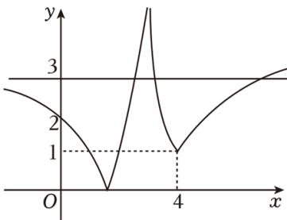

若关于 x 的方程 $m [ f \left( x \right) ] ^ { 2 } - 3 f \left( x \right) + 4 m = 0$ 有 8 个不相等的实根，令 $t { = } f \left( x \right) ,$ ，则 $m t ^ { 2 } - 3 t + 4 m = 0$ 有两个不相等的实数根 t1，t2，且 t1∈（1，3），t2∈（1，3），若 m＜0，则 $\therefore 1 + t _ { 2 } = \frac { 3 } { \pi } < 1$ 不符合，所以 m＞0，

$\scriptstyle \left( \Delta = 9 - 1 6 { \mathrm { ~ m } } ^ { 2 } > 0 \right.$ 令 g $( t ) \ = m t ^ { 2 } - 3 t + 4 m .$ ，则需要满足 $\mathfrak { g } \left( 3 \right) = 1 3 \pi \mathfrak { - } \mathfrak { g } > 0 ,$ ，解得 $\frac { 9 } { 1 3 } < x < \frac { 3 } { 4 }$ $\vert 1 < \frac { 3 } { 2 \pi } < 3$

故选：D．

16．已知函数 $\mathfrak { r } \left( \mathfrak { x } \right) = \left\{ \begin{array} { l l } { \mathrm { 1 n ~ } \mathfrak { x } + \mathfrak { x } \ \mathrm { ~ , ~ } \quad \mathfrak { x } > 1 } \\ { \displaystyle 2 \mathfrak { x } ^ { 2 } - \mathtt { m } \mathfrak { x } + \frac { \mathtt { m } } { 2 } \ \mathrm { ~ , ~ } \quad \mathfrak { x } \leqslant 1 } \end{array} \right.$ ，若 g（x）＝f（x）﹣m 有三个零点，则实数 m的取值范围是（ ）

A． $\frac { 7 } { 4 } ]$ B．（1，2] C． D．[1，3]【解答】解： $\ Y { x } > 1$ 时， $f \left( x \right) = l n x + x$ 单调递增，且 $f \left( x \right) = l n x + x > 1$ ，此时 $g \ ( x ) = f \left( x \right) - m$ 至多有一个零点，若 $g \ ( x ) = f \left( x \right) - m$ 有三个零点，则 x≤1 时，函数有两个零点；

当 x＞1 时， $f \left( x \right) = l n x + x > 1$ ，故 m＞1；

当 x≤1 时，要使 有两个零点，

$$
\left. \begin{array} { l } { { \displaystyle { \left( \triangle = \overline { { \Omega } } ^ { 2 } - 8 ( - { \frac { \pi } { 2 } } ) > _ { 0 } \right. } } } \\ { { \displaystyle { \left. \vphantom { \displaystyle { \frac { \Omega } { \Omega } ^ { 2 } - 1 } } \right. } } } \\ { { \displaystyle { \left. \vphantom { \displaystyle { \frac { \Omega } { \Omega } ^ { 2 } - 1 } } \right. } } } \end{array} \right. ,
$$

$$
\cdot 0 < \pi { \leqslant } \frac { 4 } { 3 } , \ \cdot \ m > 1 ,
$$

所以实数 m 的取值范围是 $( 1 , \quad { \frac { 4 } { 3 } } ] .$

故选：C．

17．函数 $\textbf { f } ^ { \left( \textbf { x } \right) = { ( \frac { 1 } { \mathtt { e } } ) } ^ { \mid \mathtt { x } \mid } }$ ，若 g（x）＝2f2（x）﹣（2a+3）f（x）+3a 有 4 个零点，则 a 的取值范围是（　　）

A．（1，2）

$[ \frac { 3 } { 2 } , \ 2 )$

C．

$$
( 1 , ~ \frac { 3 } { 2 } ) \cup ( \frac { 3 } { 2 } , ~ 2 )
$$

【解答】解： $\boxed { \begin{array} { c c } { { \boxplus g \ ( x ) = 2 f ^ { 2 } \ ( x ) \ \textrm { - } \ ( 2 a + 3 ) \ f \ ( x ) \ + 3 a = 0 } } \end{array} }$ ，可得[2f $\begin{array} { r l r } { \dot { \mathbf { \sigma } } ( x ) } & { { } - 3 ] { \cdot } [ f \left( x \right) } & { - a ] = } \end{array}$ 0，

解得 ${ \tt f } \left( { \tt x } \right) = \frac { 3 } { 2 } \tt { \tt f } \left( { \tt x } \right) = a ,$ ，如下图所示：

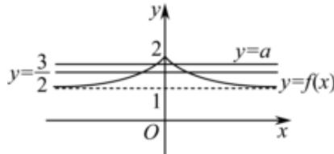

由图可知，直线 $\mathbf { y } = \frac { 3 } { 2 }$ 与函数 f（x）的图象有两个交点，

又因为函数 $g \ ( x )$ 有四个零点，故直线 $y { = } a$ 与函数 f（x）有两个零点， $\mathrm { { H } } _ { \mathfrak { a } } \neq \frac { 3 } { 2 } ;$ 所以 $\cdot 1 < a < 2 \textmd { H } _ { \textmd a } \neq \frac { 3 } { 2 } ,$

因此，实数 a 的取值范围是 $( 1 , ~ \frac { 3 } { 2 } ) \cup ( \frac { 3 } { 2 } , ~ 2 )$

故选：D．

本卷由系统自动生成，请仔细校对后使用，答案仅供参考。

# 二．函数与方程的综合运用（共 3 小题）

18．已知函数 $: f \left( x \right) = l n | x - 1 | - l n | x + 1 | ,$ ，若存在两个不同的实数 x1，x2，使 $f \left( x _ { 1 } \right) = f \left( x _ { 2 } \right)$ ），则

A． $x _ { 1 } x _ { 2 } = - \mathrm { ~ 1 ~ }$ B． $x _ { 1 } x _ { 2 } { = } 1$ C． $x _ { 1 } + x _ { 2 } < - 2$ D． $x _ { 1 } + x _ { 2 } > 2$

【解答】解：函数 $f \left( x \right) = l n | x - 1 | - l n | x + 1 |$ |，定义域为 $\big ( \mathrm { ~ - ~ } \infty , \mathrm { ~ - ~ } 1 \big )$ ）∪（﹣1，1）∪（1，+$\infty ) ,$ ，

原函数可化为 $\textrm { f } \left( \textbf { x } \right) = \ln \vert \frac { \mathbf { x } ^ { - 1 } } { \mathbf { x } ^ { + 1 } } \vert = \ln \vert 1 - \frac { 2 } { \mathbf { x } ^ { + 1 } } \vert =$ ，

$z _ { f } ( - x ) = \ln | \frac { { \bf x } + 1 } { { \bf x } - 1 } | = - 1 \ln | \frac { { \bf x } - 1 } { { \bf x } + 1 } | = - 1 ( x )$ ，函数 $f \left( x \right) = l n | x - 1 | - l n | x + 1$ |为奇函数．

因为 $\mathfrak { I } _ { \mathbf { \mathcal { Y } } } = 1 - \frac { 2 } { \mathbf { \pi } _ { \mathbf { \mathcal { X } } } + 1 } \mathrm { \mathcal { \mathrm { K } } ~ } ( \mathbf { \pi } - \infty , \mathbf { \pi } _ { - } \mathrm { \Lambda } _ { 1 } )$ 在（﹣∞，﹣1）上单调递增，且 y＞1， $\mathbf { y } = 1 - \frac { 2 } { \mathbf { x } + 1 } \mathbf { \mathcal { f } } \pm \mathbf { \mathcal { \Gamma } } ( \mathbf { \partial } - 1 , \mathbf { \partial } _ { 0 } )$ ）上单调递增且$y < - 1 ,$ ，

所以 $y = \vert 1 - \frac { 2 } { x + 1 }$ 在 $\mathrm { ~ ( ~ - ~ } \infty , \mathrm { ~ ~ - ~ } 1 \mathrm { ) }$ ）上单调递增，且 y＞1， $y = | \mathbf { \nabla } 1 - \frac { 2 } { \mathbf { x } + 1 }$ 在（﹣1，0）上单调递减且 $\ . y > 1 ,$ ，

所以当 $x \in \mathrm { ~ ( ~ - ~ } \infty , \mathrm { ~ - ~ } 1 )$ 时，函数 $f \left( x \right)$ ）单调递增， $\operatorname { E } f \left( x \right) > 0 ;$ ；

当x∈（﹣1，0）时，函数f（x）单调递减， $\operatorname { E } f \left( x \right) > 0$ ，由奇函数的图象关于原点对称，可作函数f（x）的图象如下：

由 $f \left( x _ { 1 } \right) { \overset { } { = } } f \left( x _ { 2 } \right)$ ），则 $| \frac { \mathbf { x } _ { 1 } - 1 } { \mathbf { x } _ { 1 } + 1 } | = 1 \cap | \frac { \mathbf { x } _ { 2 } - 1 } { \mathbf { x } _ { 2 } + 1 } |$ ，则 $| \frac { \mathbf { x } _ { 1 } - 1 } { \mathbf { x } _ { 1 } + 1 } | = | \frac { \mathbf { x } _ { 2 } - 1 } { \mathbf { x } _ { 2 } + 1 } |$

$\bf \Pi _ { \tilde { x } _ { 1 } + 1 } \frac { x _ { 1 } - 1 } { x _ { 2 } + 1 } = \frac { x _ { 2 } - 1 } { x _ { 2 } + 1 } \frac { x _ { 1 } - 1 } { x _ { 1 } + 1 } = - \frac { x _ { 2 } - 1 } { x _ { 2 } + 1 } ,$ 化简得 $x _ { 1 } = x _ { 2 }$ （舍去）或 $x _ { 1 } x _ { 2 } { = } 1$

故选：B．

19．已知函数 $\displaystyle \boldsymbol { r } _ { \mathbf { \lambda } ( x ) } ~ = \left\{ \begin{array} { l l } { - 1 \mathrm { n x } , ~ 0 < \mathrm { x } \leqslant 1 } \\ { \displaystyle \frac { 1 } { \mathrm { x } } , ~ \mathrm { x } > 1 } \end{array} \right.$ ，若 $0 < a < b$ 且满足 $f \left( a \right) = f \left( b \right)$ ，则 $a f \left( b \right) + b f$

（a）的取值范围是（　　）

A．（1， $\frac { 1 } { \tt e } { \tt ^ { + 1 } }$ ） B $( - \infty , \frac { 1 } { \tt e } + 1 ]$ C． $( 1 , \ \frac { 1 } { \tt _ { e } } + 1 ]$ D．（0， $\frac { 1 } { \tt e } { \tt ^ { + 1 } }$

【解答】解：∵函数 $f \left( x \right) = \left\{ \begin{array} { l l } { - 1 { \mathrm { n x } } , \ 0 < { \mathrm { x } } { \leqslant } 1 } \\ { { \frac { 1 } { \mathbf { x } } } , \ { \mathrm { x } } > 1 } \end{array} \right. ,$

若 $0 { < } a { < } b$ 且满足 $f \left( a \right) = f \left( b \right)$ ，

则-1na $- 1 \mathtt { n a } = \frac { 1 } { b }$ 且由0<-1na<1得 $\frac { 1 } { e } < a < 1$

$$
\mathfrak { L } _ { \mathtt { a f } } ( \mathtt { b } ) + \mathtt { b f } ( \mathtt { a } ) = \mathtt { a } \bullet \frac { 1 } { \mathtt { b } } + \mathtt { b } ( - \mathtt { l n } \mathtt { a } ) = - \mathtt { a l n } \mathtt { a } + 1 ( \frac { 1 } { \mathtt { e } } < \mathtt { a } < 1 )
$$

$$
\mathrm { ~  ~ { ~ g ~ } ~ } ( x ) = - x l n x + 1 , ( \frac { 1 } { \tt e } { < } x { < } 1 )
$$

$$
( x ) = - l n x - 1
$$

令 g′（x）＝0，则 $x { = } \frac { 1 } { \mathsf { e } }$

$\ Y - 1 < x < 1$ 时，g′（x）＜0，g（x）为减函数，

$$
\frac { 1 } { \tt e } { \tt ^ { + 1 } }
$$

故选：A．

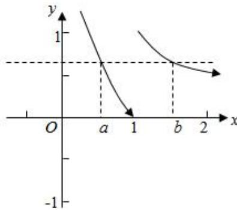

20 ． 已 知 函 数 $\begin{array} { r l r l r l } { f } & { { } \mathbf { \Phi } } & { ( } & { x } & { { } ) } & { = \mathbf { \Phi } e ^ { x } } & { \mathbf { \Phi } - } & { { } a x ^ { 2 } } \end{array}$ 的 定 义 域 为 $( { \frac { 1 } { 2 } } , \ 2 )$ ， 且 对

$\mathbf { x } _ { 1 } \neq \mathbf { x } _ { 2 } , \ \frac { \mathbf { f } \left( \mathbf { x } _ { 1 } \right) - \mathbf { f } \left( \mathbf { x } _ { 2 } \right) } { \mathbf { x } _ { 1 } - \mathbf { x } _ { 2 } } < \mathbf { x } _ { 1 } + \mathbf { x } _ { 2 }$ 恒成立，则实数 a 的取值

A． $[ \frac { e ^ { 2 } } { 4 } - 1 , + \infty )$ B． C． D． $( - \infty , \frac { \textsf { e } } { 2 } - 1 )$

【 解 答 】 解 ： 设 x1 ＞ x2 因 为

$\mathbf { x } _ { 1 } \neq \mathbf { x } _ { 2 } , \ \frac { \textnormal { f } ( \mathbf { x } _ { 1 } ) - \textnormal { f } ( \mathbf { x } _ { 2 } ) } { \mathbf { x } _ { 1 } - \mathbf { x } _ { 2 } } < \mathbf { x } _ { 1 } + \mathbf { x } _ { 2 }$ 恒成立，

等价于 f $( x _ { 1 } ) - f ( x _ { 2 } ) < x _ { 1 } ^ { 2 } - x _ { 2 } ^ { 2 } ,$ ，即 f $\begin{array} { r } { \hat { { \mathbf { \xi } } } ( x _ { 1 } ) { \mathbf { \zeta } } - x _ { 1 } ^ { 2 } { < } f ^ { \mathbf { \xi } } ( x _ { 2 } ) { \mathbf { \zeta } } - x _ { 2 } ^ { 2 } , } \end{array}$

令 $F \ ( x ) \ = f \ ( x ) - x ^ { 2 } = e ^ { x } - a x ^ { 2 } - x ^ { 2 }$ ，则 F $( x _ { 1 } ) < F \ ( x _ { 2 } )$ ，所以 $F ^ { \mathrm { ~ ( ~ ) ~ } } \overleftarrow { \mathrm { ! \pm } }                ( \frac { 1 } { 2 } , \ 2 )$ 上为减函数，

所以 F′（x）＝ex﹣2（a+1）x≤0 在在 上恒成立，即 $\frac { e ^ { x } } { x } \leqslant 2 ( a + 1 ) \sqrt { \pm } ( \frac { 1 } { 2 }$ 上恒成立，

$\mathbf { \Sigma } ( x ) ~ = \frac { \mathsf { e } ^ { \frac { \mathbf { x } } { \mathbf { \varepsilon } } } } { \mathbf { x } } , ~ x \in ( \frac { 1 } { 2 } , ~ 2 )$ ∈ ，则 h′（x）＝ ＞0，

所以函数 h（x）在 上单调递减，在（1，2）单调递增，

又 h $( { \frac { 1 } { 2 } } ) = 2 { \sqrt { \mathsf { e } } } ,$ ，h $( 2 ) = { \frac { \mathsf { e } ^ { 2 } } { 2 } } ,$ 且 $\sqrt { e } < \frac { e ^ { 2 } } { 2 } ,$

$$
h { \bf \Psi } ( x ) { \bf \Psi } _ { m a x } { < } h { \bf \Psi } ( 2 { \bf \Psi } ) { \bf \Psi } = \frac { { \tt e } ^ { 2 } } { 2 } ,
$$

所以 $\frac { e ^ { 2 } } { 2 } \leqslant 2 ( a + 1 )$ ，解得 $a { \geq } \frac { \mathsf { e } ^ { 2 } } { 4 } { - } 1 ,$

故选：A．